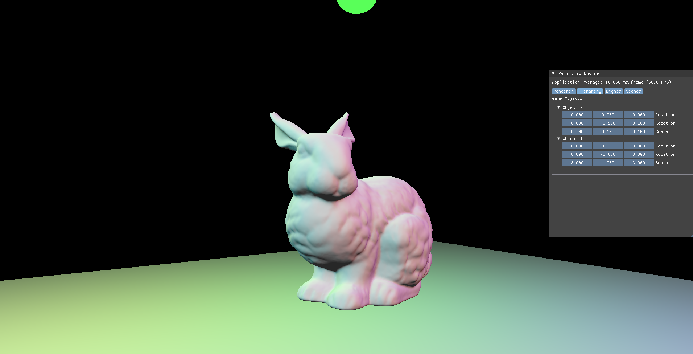
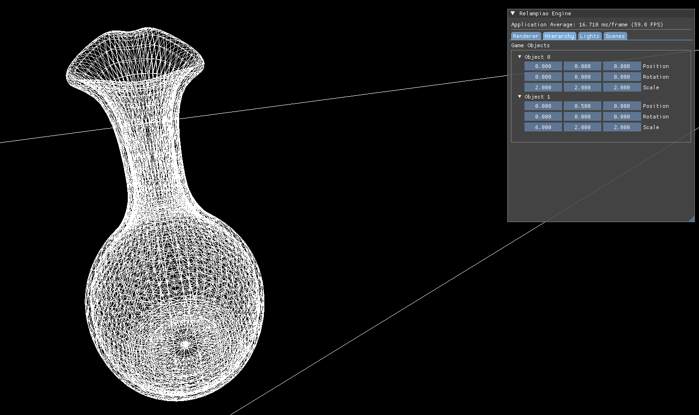
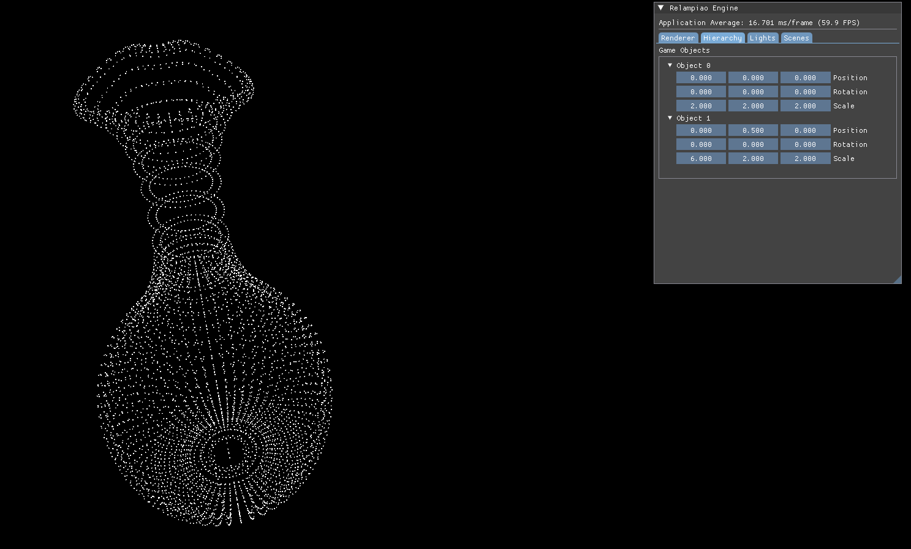

# RELAMPIÃO





A personal 3D renderer and engine built from scratch in C++ and Vulkan. Started as a way to understand how rendering really works under the hood — ended up becoming an ongoing project with scene management, physically-based lighting, ray tracing, and a solar system simulation.

## What it does
 
- **Real-time 3D rendering** with Vulkan — descriptor sets, render passes, UBOs, swap chain management
- **CPU ray tracer** — path tracing implementation running alongside the rasterizer
- **PBR-ready material pipeline** — texture support per object, albedo maps, switchable per scene
- **Point light system** — multiple colored lights with attenuation, updated per frame
- **Dynamic scene loading** — switch between scenes at runtime without restarting (default scene + solar system)
- **Solar system simulation** — all planets from Mercury to Neptune with orbital mechanics, self-rotation, and individual textures
- **ImGui interface** — runtime controls for scene switching and render settings
- **Keyboard camera controller** — 6DOF movement in the scene
- **Automatic shader compilation** — GLSL shaders compiled to SPIR-V at build time via CMake
---
 
## Stack
 
- **C++17**
- **Vulkan** — graphics API
- **GLFW** — window and input
- **GLM** — math
- **ImGui** — UI
- **tinyobjloader** — OBJ model loading
- **CMake** — build system
---
 
## Building
 
Requires: Visual Studio 2022, Vulkan SDK 1.2+, CMake 3.11+
 
```bash
git clone <repo>
cd Relampao
```
 
Create a `.env.cmake` in the root:
 
```cmake
set(VULKAN_SDK_PATH "C:/VulkanSDK/1.3.x")
set(GLFW_PATH "C:/libs/glfw-3.4")
set(TINYOBJ_PATH "C:/libs/tinyobjloader")
set(GLM_PATH "C:/libs/glm")
```
 
Then:
 
```bash
mkdir build && cd build
cmake -S ../ -B .
cmake --build . --config Release
```
 
Or open `build/VulkanGameEngine.sln` in Visual Studio and build from there.
 
---
 
## Controls
 
| Key | Action |
|-----|--------|
| WASD | Move camera |
| Mouse | Look around |
| ImGui panel | Switch scenes, toggle settings |
 
---
 
## References
 
- [Brendan Galea's Vulkan tutorial series](https://www.youtube.com/c/BrendanGalea)
- [vulkan-tutorial.com](https://vulkan-tutorial.com)

